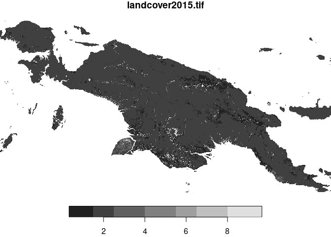

<!-- README.md is generated from README.Rmd. Please edit that file -->

# motif

<!-- badges: start -->

[](https://travis-ci.org/Nowosad/motif)
[](https://github.com/Nowosad/motif/actions)
[](https://codecov.io/gh/Nowosad/motif?branch=master)
<!-- badges: end -->

The **motif** package implements ideas of the pattern-based spatial
analysis in R. It describes spatial patterns of categorical raster data
for any defined regular and irregular areas. Patterns are represented
quantitatively using built-in signatures based on co-occurrence matrices
but also allows for any user-defined functions. It enables spatial
analysis such as search, change detection, and clustering to be
performed on spatial patterns.

## Installation

<!-- You can install the released version of motif from [CRAN](https://CRAN.R-project.org) with: -->

<!-- ``` r -->

<!-- install.packages("motif") -->

<!-- ``` -->

And the development version from [GitHub](https://github.com/) with:

``` r
# install.packages("remotes")
remotes::install_github("Nowosad/motif")
```

## Example

The **motif** package works on raster data represented by `stars`
objects. It has several example datasets, including
`"raster/landcover2015.tif"`. This file contains a land cover data for
New Guinea, with seven possible categories: (1) agriculture, (2) forest,
(3) grassland, (5) settlement, (6) shrubland, (7) sparse vegetation, and
(9) water.

``` r
library(motif)
library(stars)
#> Loading required package: abind
#> Loading required package: sf
#> Linking to GEOS 3.8.0, GDAL 3.0.4, PROJ 7.0.0
landcover = read_stars(system.file("raster/landcover2015.tif", package = "motif"))
# landcover = droplevels(landcover)
plot(landcover, key.pos = 4, key.width = lcm(5))
```



### Signatures

We can see that most of the island is covered by forest, with some
agriculture and smaller areas of the other classes. It is also
reasonably easy to describe this proportions (so called composition)
numericaly - we just need to count cells of each category for the whole
data.

We can use the `lsp_thumbprint()` function for this. It requires a
`stars` object as the first input and the type of a signature to
calculate - `"composition"` in this case. There are also several
additional arguments, including `threshold` - a share (between 0 and 1)
of NA cells to allow signature calculation and `normalization` -
decision if the output vector should be normalized.

``` r
landcover_comp = lsp_thumbprint(landcover, 
                                type = "composition",
                                threshold = 1,
                                normalization = "none")
landcover_comp
#> # A tibble: 1 x 3
#>      id na_prop signature        
#> * <int>   <dbl> <list>           
#> 1     1   0.666 <int[,7] [1 × 7]>
```

The output of `lsp_thumbprint()` has a new class `lsp`. It is a tibble
with three columns: - `id` - an id of each window (area) - `na_prop` -
share (0-1) of `NA` cells for each window - `signature` - a list-column
containing with calculated signatures

We can take a look at the last column:

``` r
landcover_comp$signature
#> [[1]]
#>           1       2     3    5    6     7      9
#> [1,] 862001 8122776 84482 4311 2677 78555 203444
```

It is a list of signatures. In this case, we have just one signature
describing the whole area in form of a numeric vector. It contains how
many cells belong to each land cover category. For example, there are
8122776 cells of forest, but only 2677 cells of shrubland.

<!-- However, it is not that easy to describe landscape patterns numericaly.  -->

<!-- We can try to... -->

<!-- ... -->

<!-- ... -->

Another approach would be to devide this large area into many regular
rectangles (we refer to them as local landscapes) and to calculate a
signature in each of them. The previously used signature,
`"composition"` has one important flaw though. It only describes how
many cells of each category we have. However, it does not distinguish an
area with left half of forest and right half of agriculture from an area
with forest mixed with agriculture (think of a checkerboard). Gladly,
there are several more types of signatures exist. It includes a
co-occurrence matrix (`type = "coma"`). `"coma"` goes to each cell,
looks at its value, looks at the values of its neighbors and count how
many neighbors of each class our central cell has.

``` r
landcover_coma = lsp_thumbprint(landcover, type = "coma", window = 200)
landcover_coma
#> # A tibble: 232 x 3
#>       id na_prop signature        
#>  * <int>   <dbl> <list>           
#>  1     3  0.0992 <int[,7] [7 × 7]>
#>  2     4  0.145  <int[,7] [7 × 7]>
#>  3    38  0.255  <int[,7] [7 × 7]>
#>  4    39  0      <int[,7] [7 × 7]>
#>  5    40  0      <int[,7] [7 × 7]>
#>  6    41  0      <int[,7] [7 × 7]>
#>  7    42  0      <int[,7] [7 × 7]>
#>  8    43  0.115  <int[,7] [7 × 7]>
#>  9    77  0      <int[,7] [7 × 7]>
#> 10    78  0      <int[,7] [7 × 7]>
#> # … with 222 more rows
```

Now, we have one row per local landscape, where each local landscape is
described by an id (`id`), proportion of cells with `NA`s (`na_prop`),
and a signature (`signature`). For example, the first signature looks
like this:

``` r
landcover_coma$signature[[1]]
#>    1      2 3 5 6 7    9
#> 1 32     47 0 2 0 0    6
#> 2 47 141250 0 7 0 0  226
#> 3  0      0 0 0 0 0    0
#> 5  2      7 0 4 0 0    0
#> 6  0      0 0 0 0 0    0
#> 7  0      0 0 0 0 0    0
#> 9  6    226 0 0 0 0 1462
```

It is a matrix where each row and column represent subsequent land cover
classes. For example, 141250 times forest cell is next to anther forest
cell, and 226 times water cell is next to forest cell. You can learn
more about this signature at
<https://nowosad.github.io/comat/articles/coma.html>.

Importantly, this and some other signatures can be used not only to
describe landscapes, but also to search for other similar landscapes,
compare landscapes, and cluster them.

<!-- create a summary image -->

You can find examples of each of above applications in the vignettes:

<!-- ref to vig -->

<!-- ### Search -->

<!-- ### Compare -->

<!-- ### Cluster -->

## Contribution

Contributions to this package are welcome. The preferred method of
contribution is through a GitHub pull request. Feel free to contact us
by creating [an issue](https://github.com/Nowosad/motif/issues).
